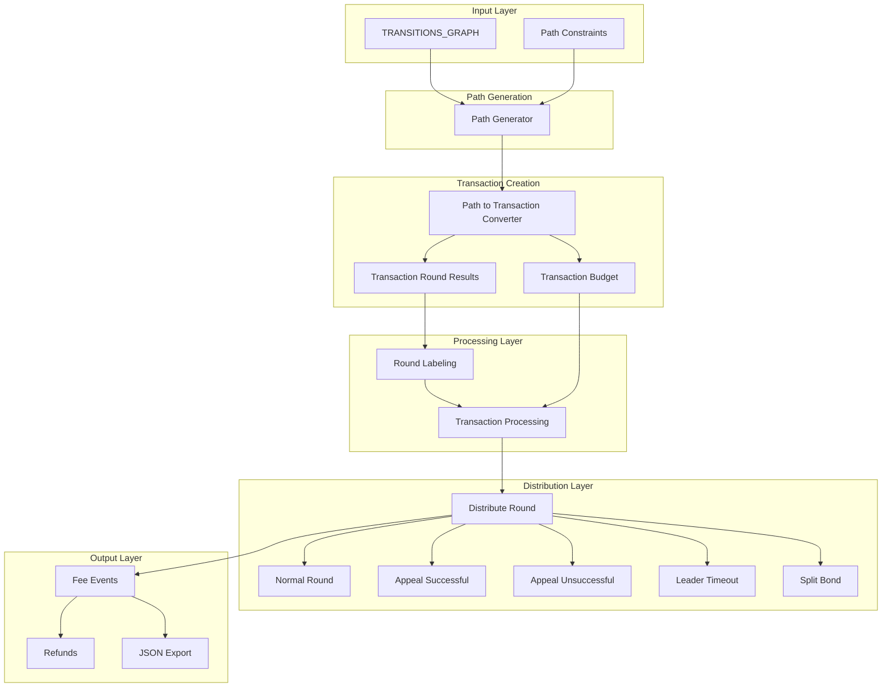
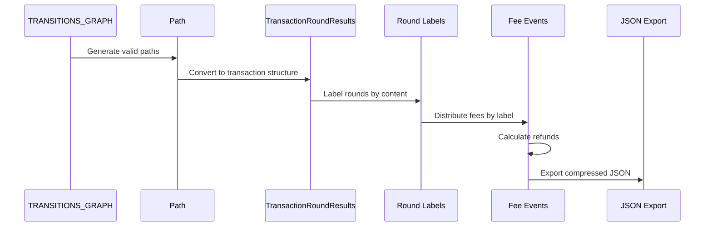
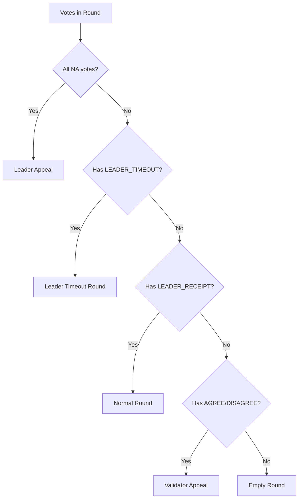
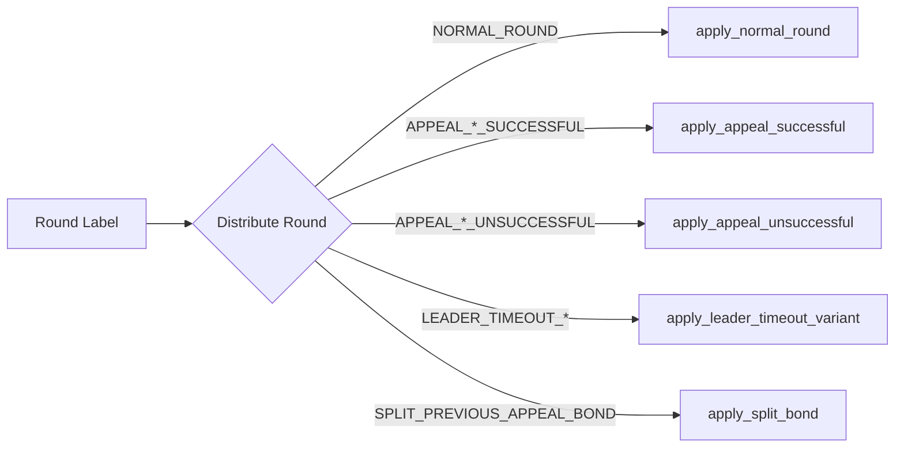
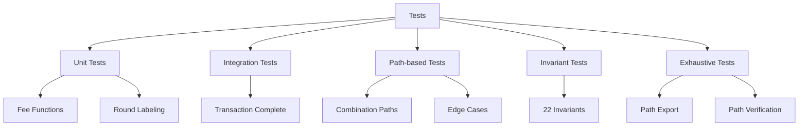

# GenLayer Fee Distribution Simulator Architecture

## Table of Contents
1. [Overview](#overview)
2. [Core Architecture](#core-architecture)
3. [Data Flow](#data-flow)
4. [Key Components](#key-components)
5. [Round Types and Labeling](#round-types-and-labeling)
6. [Fee Distribution Logic](#fee-distribution-logic)
7. [Testing Architecture](#testing-architecture)
8. [Path Generation and Export](#path-generation-and-export)
9. [Recent Refactors](#recent-refactors)

## Overview

The GenLayer Fee Distribution Simulator is a comprehensive system for modeling and testing fee distribution mechanisms in a blockchain validator network. It simulates complex transaction scenarios involving validators, leaders, appeals, and various edge cases to ensure correct fee distribution.

### Key Design Principles
- **Path-based Flow**: The system follows a deterministic flow from graph paths to fee distributions
- **Content-based Detection**: Round types are determined by vote patterns, not indices
- **Immutable Data Structures**: All fee events are immutable for auditability
- **Comprehensive Testing**: Every path through the system is tested with 22 invariants
- **Exhaustive Verification**: Can generate ~113M paths for external validation

## Core Architecture



## Data Flow

The system follows a strict unidirectional data flow:



### 1. **Graph → Path**
- The `TRANSITIONS_GRAPH` in `tests/round_combinations/graph_data.py` defines all valid state transitions
- Path generator creates sequences like `["START", "LEADER_RECEIPT_MAJORITY_AGREE", "APPEAL_VALIDATOR_SUCCESSFUL", "END"]`
- Single source of truth for all possible transaction flows

### 2. **Path → Transaction**
- `path_to_transaction.py` converts paths to `TransactionRoundResults`
- Creates appropriate vote patterns for each node type
- Generates `TransactionBudget` with appeal information
- Handles consecutive appeals correctly

### 3. **Transaction → Labels**
- `round_labeling.py` analyzes vote patterns to determine round types
- No dependency on round indices - purely content-based
- Applies special pattern transformations (e.g., SKIP_ROUND)
- Handles consecutive appeals by looking back to original normal round

### 4. **Labels → Fees**
- `distribute_round.py` routes to specific distribution functions
- Each label has a corresponding fee distribution strategy
- Events are immutable and include all transaction details

### 5. **Fees → Export**
- `scripts/generate_path_jsons.py` exports compressed JSON files
- Sequential address numbering (1, 2, 3...)
- Bitfield encoding for invariant results
- ~800 bytes per path vs 43KB uncompressed

## Key Components

### Models (`models.py`)
```python
# Core data structures
TransactionRoundResults  # Contains all rounds in a transaction
Round                   # Contains rotations (re-elections)
Rotation               # Contains votes from participants
TransactionBudget      # Defines costs and appeals
FeeEvent              # Immutable record of fee changes
Appeal                # Appeal information with appealant address
```

### Constants
```python
# Round sizes (after ROUND_SIZES split)
NORMAL_ROUND_SIZES = [5, 11, 23, 47, 95, 191, 383, 767, 1000]
APPEAL_ROUND_SIZES = [7, 13, 25, 49, 97, 193, 385, 769, 1000]

# Penalty coefficients
PENALTY_REWARD_COEFFICIENT = 1
IDLE_PENALTY_COEFFICIENT = 10
DETERMINISTIC_VIOLATION_PENALTY_COEFFICIENT = 100
```

### Vote Types
- `LEADER_RECEIPT`: Leader successfully submitted a result
- `LEADER_TIMEOUT`: Leader failed to submit in time
- `AGREE`/`DISAGREE`: Validator votes on leader's submission
- `TIMEOUT`: Validator didn't vote in time
- `IDLE`: Validator was idle (replaced)
- `NA`: Not applicable (used in appeals)

## Round Types and Labeling

### Detection Logic
Round types are detected based on vote patterns, not indices:



### Round Labels
1. **Normal Rounds**
   - `NORMAL_ROUND`: Standard round with clear outcome
   - `LEADER_TIMEOUT`: Leader failed to respond
   - `SKIP_ROUND`: Retroactively skipped due to successful appeal

2. **Appeal Rounds**
   - `APPEAL_LEADER_SUCCESSFUL/UNSUCCESSFUL`: Leader being appealed
   - `APPEAL_VALIDATOR_SUCCESSFUL/UNSUCCESSFUL`: Validators appealing majority
   - `APPEAL_LEADER_TIMEOUT_SUCCESSFUL/UNSUCCESSFUL`: Timeout being appealed

3. **Special Cases**
   - `LEADER_TIMEOUT_50_PERCENT`: Single timeout round
   - `LEADER_TIMEOUT_150_PREVIOUS_NORMAL_ROUND`: After successful timeout appeal
   - `LEADER_TIMEOUT_50_PREVIOUS_APPEAL_BOND`: After unsuccessful appeal
   - `SPLIT_PREVIOUS_APPEAL_BOND`: Undetermined after unsuccessful appeal

### Pattern Transformations
Special patterns trigger label transformations:

```python
# Example: Skip round before successful appeal
["NORMAL_ROUND", "APPEAL_LEADER_SUCCESSFUL", "NORMAL_ROUND"]
# Transforms to:
["SKIP_ROUND", "APPEAL_LEADER_SUCCESSFUL", "NORMAL_ROUND"]
```

### Consecutive Appeal Handling
The system correctly handles consecutive appeals:
```python
def classify_appeal_round(round_index, rounds, leader_addresses):
    # Look back to find the original normal round being appealed
    original_round_index = round_index - 1
    while original_round_index > 0:
        if is_likely_appeal_round(rounds[original_round_index], ...):
            original_round_index -= 1
        else:
            break
    # Classify based on the original normal round
```

## Fee Distribution Logic

### Distribution Router


### Fee Event Structure
```python
FeeEvent(
    sequence_id=1,          # Global sequence number
    address="0x...",        # Participant address
    round_index=0,          # Round in transaction
    round_label="NORMAL_ROUND",
    role="VALIDATOR",       # LEADER, VALIDATOR, APPEALANT, SENDER
    vote="AGREE",          
    earned=200,            # Amount earned
    cost=0,                # Amount paid
    burned=0,              # Amount burned (penalties)
    slashed=0,             # Amount slashed
    staked=0               # Stake changes
)
```

### Distribution Examples

#### Normal Round (Majority Agree)
- Leader: Earns `leader_timeout + validator_timeout`
- Majority validators: Earn `validator_timeout`
- Minority validators: Burned `PENALTY_REWARD_COEFFICIENT * validator_timeout`

#### Successful Appeal
- Appealant: Earns `appeal_bond + leader_timeout` (leader appeal) or `appeal_bond` (validator appeal)
- Validators: Distribution depends on appeal type

#### Split Bond (Undetermined after unsuccessful appeal)
- Leader: Earns `leader_timeout`
- Validators: Split the appeal bond equally

## Testing Architecture

### Test Categories



### Test Organization

1. **Unit Tests** (`tests/fee_distributions/unit_tests/`)
   - Test individual distribution functions
   - Mock dependencies
   - Fast execution

2. **Round Labeling Tests** (`tests/round_labeling/`)
   - Test pattern detection
   - Property-based testing with Hypothesis
   - Exhaustive path testing
   - Chained appeal scenarios

3. **Fee Distribution Tests** (`tests/fee_distributions/`)
   - `simple_round_types_tests/`: Test each round type individually
   - `check_invariants/`: Comprehensive invariant checking
   - Integration tests with full transaction flow

4. **Path Combination Tests** (`tests/round_combinations/`)
   - Generate all valid paths from `TRANSITIONS_GRAPH`
   - Matrix-based counting and DFS generation
   - Critical path analysis
   - Test exhaustively up to certain lengths

5. **Slashing Tests** (`tests/slashing/`)
   - Test idleness penalties
   - Test deterministic violation penalties
   - Test tribunal appeals

### 22 Invariants
The system maintains critical invariants checked in `comprehensive_invariants.py`:

1. Conservation of value
2. Non-negative balances
3. Appeal bond coverage
4. Majority/minority consistency
5. Role exclusivity
6. Sequential processing
7. Appeal follows normal
8. Burn non-negativity
9. Refund non-negativity
10. Vote consistency
11. Idle slashing correctness
12. Deterministic violation slashing
13. Leader timeout earning limits
14. Appeal bond consistency
15. Round size consistency
16. Fee event ordering
17. Stake immutability
18. Round label validity
19. No double penalties
20. Earning justification
21. Cost accounting
22. Slashing proportionality

### Test Execution Flow
```python
# For each path in TRANSITIONS_GRAPH
path = ["START", "LEADER_RECEIPT_MAJORITY_AGREE", "END"]
↓
transaction = path_to_transaction_results(path)
↓
labels = label_rounds(transaction)
↓
fee_events = process_transaction(transaction)
↓
check_comprehensive_invariants(fee_events, transaction, labels)
```

## Path Generation and Export

### Path Generation (`scripts/generate_path_jsons.py`)
- Generates all paths from TRANSITIONS_GRAPH
- Exports compressed JSON files (~800 bytes each)
- Sequential address numbering (1, 2, 3...)
- Bitfield encoding for invariant results
- Organized by path length

### JSON Format
```json
{
  "path": [0, 1, 6, 12],           // Node indices
  "labels": [0, 6],                // Round label indices
  "participants": {                // Only active participants
    "1": {
      "r": [[0,0], [1,1]],        // [round_index, role_index]
      "c": 0,                     // cost
      "e": 300,                   // earned
      "s": 0,                     // slashed
      "b": 0                      // burned
    }
  },
  "invariants": 4194303,          // Bitfield (all 22 bits set)
  "hash": "0cd0354f..."           // Path hash
}
```

### Path Visualization (`scripts/decode_path_json.py`)
- Decodes compressed JSON format
- Reconstructs full transaction
- Displays multiple visualizations:
  - Compressed data summary
  - Transaction results
  - Fee distribution details
  - Summary table

### Export Statistics
- Length 3: 4 paths
- Length 7: 484 paths
- Length 17: ~113M paths (estimated)

## Recent Refactors

### 1. **ROUND_SIZES Split**
- Split `ROUND_SIZES` into `NORMAL_ROUND_SIZES` and `APPEAL_ROUND_SIZES`
- Allows independent sizing for normal rounds vs appeals
- Simplifies chained appeal handling

### 2. **Index-based to Content-based Detection**
- Removed all `i % 2` logic for appeal detection
- Appeals detected by vote patterns (NA votes, no leader receipt)
- More flexible and maintainable

### 3. **Path-based Testing**
- Moved from manual test case creation to path generation
- `TRANSITIONS_GRAPH` as single source of truth
- Exhaustive testing of all valid scenarios

### 4. **Appeal Index Calculation**
- Removed `floor(round_index / 2)` calculations
- Count actual appeal rounds to find indices
- Find previous normal rounds by searching backwards

### 5. **Consecutive Appeal Fix**
- Fixed round labeling to handle consecutive appeals
- Look back through appeal chain to find original normal round
- Prevents misclassification of chained appeals

### 6. **JSON Export System**
- Added compressed JSON export for all paths
- Enables external verification by consensus team
- Efficient format reduces storage by 98%

## Configuration and Extension

### Adding New Round Types
1. Add to `RoundLabel` type definition
2. Create distribution function in `round_fee_distribution/`
3. Add case in `distribute_round.py`
4. Update pattern matching in `round_labeling.py`
5. Add to lookup tables in export scripts
6. Add tests

### Adding New Vote Types
1. Update `Vote` type definition
2. Modify vote pattern detection in `is_likely_appeal_round()`
3. Update majority calculation if needed
4. Add test cases

### Modifying Penalties
1. Update coefficient constants
2. Ensure distribution functions use constants
3. Run invariant tests to verify conservation

## Performance Considerations

- **Path Generation**: Exponential growth with max length
  - Length 3: 4 paths
  - Length 7: 484 paths
  - Length 17: ~113 million paths
- **Memory**: Fee events are kept in memory
- **JSON Export**: ~800 bytes per path compressed
- **Optimization**: Use batch processing for large path sets

## Round Sizes and Validator Selection Logic

### Round Size Constants

The system uses two separate arrays for round sizes defined in `constants.py`:

```python
NORMAL_ROUND_SIZES = [5, 11, 23, 47, 95, 191, 383, 767, 1000]
APPEAL_ROUND_SIZES = [7, 13, 25, 49, 97, 193, 385, 769, 1000]
```

These sizes follow an exponential growth pattern (approximately doubling) to:
- Ensure sufficient validators for consensus
- Scale security with transaction importance
- Balance between decentralization and efficiency

### Validator Selection Patterns

There are two main patterns for validator selection depending on appeal outcomes:

#### Pattern 1: Successful Appeal
When an appeal is successful, validators are combined:
```
Next round size = Previous normal round + Appeal round - 1
```
Where the `-1` represents excluding the original leader who was appealed.

#### Pattern 2: Chained Unsuccessful Appeals
When appeals are unsuccessful and chained, the system progresses through the arrays independently:
```
Normal rounds: Use next index in NORMAL_ROUND_SIZES
Appeal rounds: Use next index in APPEAL_ROUND_SIZES
```

### Key Properties

1. **Leader Exclusion**: Only occurs after successful appeals
2. **Independent Progression**: Unsuccessful appeals don't affect round size calculation
3. **Array Index Tracking**: System maintains separate indices for normal and appeal rounds
4. **Validator Pool Growth**: New validators are added as needed to meet round sizes

## Future Enhancements

1. **Parallel Processing**: For large-scale path generation
2. **Incremental Export**: Stream JSON files instead of batch
3. **Path Filtering**: Generate only specific path patterns
4. **Visualization Dashboard**: Web interface for path exploration
5. **Performance Metrics**: Track processing time per path